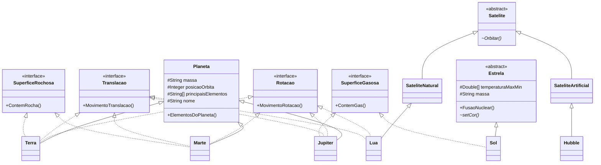

# 🪐 Sistema Solar — Programação Orientada a Objetos em Java


Aplicação de console que apresenta informações sobre **planetas, estrelas e satélites** do Sistema Solar.

O objetivo real do projeto não é a astronomia — é exercitar os pilares da Programação Orientada a Objetos. Cada corpo celeste foi modelado como uma classe, e as características que eles compartilham (girar em torno do próprio eixo, orbitar o Sol, ter superfície rochosa ou gasosa) viraram **interfaces**, aplicadas só a quem realmente as possui.

---

## 🚀 Como executar

Você precisa apenas do **JDK 17 ou superior** instalado.

### Com Maven

```bash
mvn compile
mvn exec:java -Dexec.mainClass="com.example.view.Main"
```

### Sem Maven, direto pelo JDK

```bash
javac -encoding UTF-8 -d build $(find src -name "*.java")
java -cp build com.example.view.Main
```

No Windows (PowerShell):

```powershell
javac -encoding UTF-8 -d build (Get-ChildItem -Recurse -Filter *.java src).FullName
java -cp build com.example.view.Main
```

---

## 💻 Demonstração

```
Olá, tudo bem? Voce gostaria de conhecer mais sobre astronomia?
Escreva 1 para saber mais sobre planetas, escreva 2 para estrelas
e escreva 3 para satelites.
> 1

🌍 === INFORMAÇÕES SOBRE PLANETAS === 🌍

🌎 PLANETA TERRA:
O planeta Terra tem como os 3 principais componentes [Oxigênio, Silício, Ferro]
A Terra realiza rotação em torno de seu próprio eixo, demorando 24 horas
A Terra realiza translação em torno do Sol, demorando 365 dias e 6 horas
A Terra tem superficie rochosa
```

```
> 2

☀️ === INFORMAÇÕES SOBRE ESTRELAS === ☀️

🔆 ESTRELA SOL:
A cor do Sol é laranja
Estrelas realizam a fusão nuclear, elas queimam seus proprios elementos,
criando energia, que emite luz
O Sol é composto por gases como:
Hélio
Hidrogenio
```

---

## 🧠 Conceitos de POO aplicados

| Conceito | Onde aparece no projeto |
|---|---|
| **Herança** | `Terra`, `Marte` e `Jupiter` estendem `Planeta`; `Sol` estende `Estrela`; `Lua` e `Hubble` descendem de `Satelite` |
| **Classes abstratas** | `Estrela` e `Satelite` — não fazem sentido instanciadas sozinhas, só servem de base |
| **Métodos abstratos** | `Estrela.setCor()` e `Satelite.Orbitar()` — cada subclasse é obrigada a dar a sua versão |
| **Interfaces** | `Rotacao`, `Translacao`, `SuperficeRochosa`, `SuperficeGasosa` |
| **Polimorfismo** | `MovimentoRotacao()` existe na Terra, em Marte, em Júpiter e na Lua — com comportamento diferente em cada um |
| **Encapsulamento** | atributos `protected` e `private`, expostos por métodos públicos |
| **Sobrescrita** | `@Override` em todas as implementações de interface e de método abstrato |
| **Método final** | `Sol.ContemGas()` e `Jupiter.ContemGas()` — marcados `final`, não podem ser redefinidos |

O detalhe que faz a modelagem funcionar: **`SuperficeRochosa` e `SuperficeGasosa` são interfaces separadas**. Terra e Marte implementam a primeira, Júpiter e o Sol implementam a segunda. Nenhum corpo celeste carrega um comportamento que não é dele.

---

## 🗺️ Diagrama de classes



---

## 🏛️ Arquitetura

O projeto segue **MVC**, com cada responsabilidade em seu pacote:

```
src/main/java/com/example/
├── view/
│   └── Main.java              → menu e leitura da escolha do usuário
├── controller/
│   └── Controller.java        → recebe a opção e direciona o fluxo
├── service/
│   └── Services.java          → monta os objetos e organiza as informações
├── interfaces/
│   ├── Rotacao.java
│   ├── Translacao.java
│   ├── SuperficeRochosa.java
│   └── SuperficeGasosa.java
└── model/
    ├── Estrela/
    │   ├── Estrela.java       (abstrata)
    │   └── Sol.java
    ├── Planeta/
    │   ├── Planeta.java       (base)
    │   ├── Terra.java
    │   ├── Marte.java
    │   └── Jupiter.java
    └── Satelite/
        ├── Satelite.java              (abstrata)
        ├── SateliteNatural.java
        ├── SateliteArtificial.java
        ├── Lua.java                   (natural)
        └── Hubble.java                (artificial)
```

O `Main` não conhece nenhum planeta. Ele só lê uma opção e entrega ao `Controller`, que chama o `Services`, que é quem conversa com o `model`. Trocar a interface de console por uma API web exigiria reescrever apenas a camada `view`.

---

## 🛠️ Tecnologias

- **Java 17+**
- **Maven** — build e gerenciamento do projeto

---

## 👩‍💻 Autora

**Luana Rodrigues Chaves**
[](https://github.com/luanarchaves)
